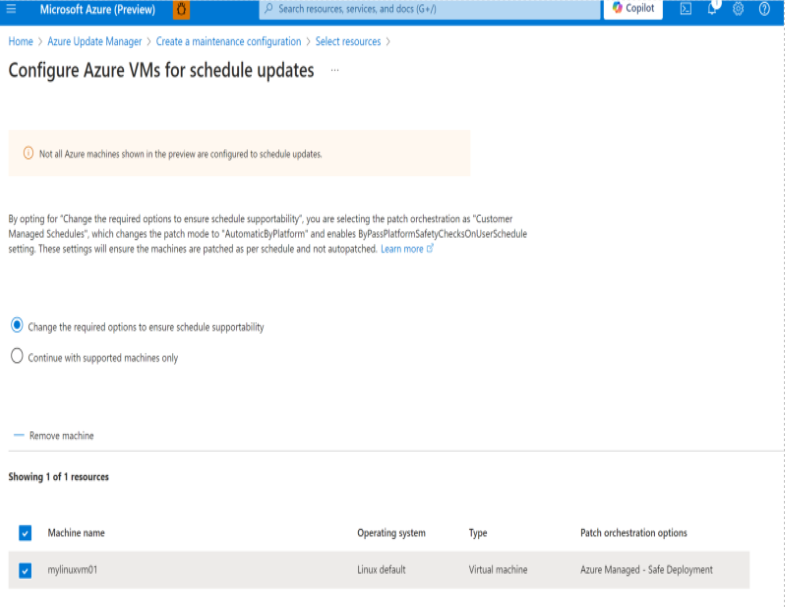
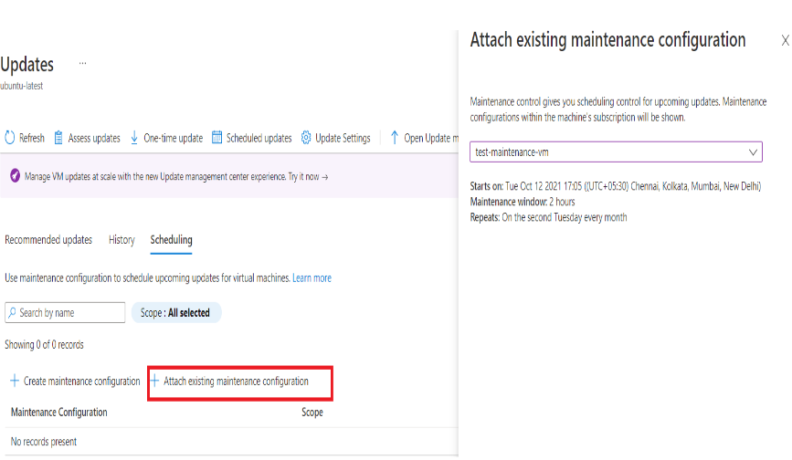

# Schedule recurring Guest Patches with Azure Update Manager

If automatic VM guest patching is enabled on a VM, then the available Critical and Security patches are downloaded and applied automatically on the VM. Automatic VM Guest Patching is integrated with Azure Update Manager service.
To install patches with other patch classifications or schedule patch installation within your own custom maintenance window you can use Azurer Update Manager. 

Enabling automatic guest patching for your Azure Virtual Machines (VMs) and Scale Sets (VMSS) helps ease update management by safely and automatically patching virtual machines to maintain security compliance, while limiting the blast radius of VMs. Patches classified as Critical or Security are automatically downloaded and applied on the VM.

In this Lab we’re going to use Azure Update Manager service to schedule recurring updates for our VM.  

## Prerequisite for this Lab 

Linux VM
Permissions to create a new VM 

Prerequisites for scheduled patching 

See [Prerequisites for Update Manager](https://learn.microsoft.com/en-us/azure/update-manager/prerequisites) 

Patch orchestration of the Azure machines should be set to Customer Managed Schedules. For more information, see [Enable schedule patching on existing VMs](https://learn.microsoft.com/en-us/azure/update-manager/prerequsite-for-schedule-patching?tabs=new-prereq-portal%2Cauto-portal#enable-schedule-patching-on-azure-vms). For Azure Arc-enabled machines, it isn't a requirement. 

 

## TASK 1 : Schedule recurring updates at scale 

To schedule recurring updates at scale, follow these steps. 

You can schedule updates from the Overview or Machines pane. 

In this lab we’re going to use Overview Pane :  

To schedule recurring updates at scale, follow these steps.

You can schedule updates from the **Overview** or **Machines** pane.

**From the Overview pane**

1. Sign in to the [Azure portal](https://portal.azure.com).

1. On the **Azure Update Manager** | **Overview** page, select your subscription, and then select **Schedule updates**.

1. On the **Create new maintenance configuration** page, you can create a schedule for multiple machines.

	Currently, VMs and maintenance configuration in the same subscription are supported.

1. On the **Basics** tab, select **Subscription**, **Resource Group**, and all options in **Instance details**.
	- Select **Add a schedule**. In **Add/Modify schedule**, specify the schedule details, such as:
	
		- **Start on**
		- **Maintenance window** (in hours)
		- **Repeats** (monthly, daily, or weekly)
		- **Add end date**
		- **Schedule summary**

For **Repeats monthly**, there are two options: 

Repeat on a calendar date (optionally run on the last date of the month). 

Repeat on nth (first, second, etc.) x day (for example, Monday, Tuesday) of the month. You can also specify an offset from the day set. It could be +6/-6. For example, if you want to patch on the first Saturday after a patch on Tuesday, set the recurrence as the second Tuesday of the month with a +4 day offset. Optionally, you can also specify an end date when you want the schedule to expire. 

5. On the **Resources** tab, Click  Add Resources , select your Subscription and then select your **myBackendVM** then **Save**. See **!NOTE** below. 
You can select more than one VM on this step however *myFrontendVM* is Ubuntu2404 and it is currently not supported on Azure Update Manager. So, we use *myBackendVM* on our lab. 
6. You can continue with default settings for  **Dynamic Scopes**. 

7. On the **Updates** tab, specify the updates to include in the deployment, such as update classifications or KB ID/packages that must be installed when you trigger your schedule. Continue with default setting.

	Update Manager doesn't support driver updates.

8. Continue with default settings on **Events** tab for this Lab. 
 
9. On the **Review + create** tab, verify your update deployment options, and then select **Create**.
 
## [!NOTE]

>  
>  You may get the below warning. You can continue with “Change the required options to ensure schedule supportability” option. Basically it will enable ByPassPlatformSafetyChecksOnUserSchedule for you.  

>  *Not all Azure machines shown in the preview are configured to schedule updates. By opting for “Change the required options to ensure schedule supportability”, you are selecting the patch orchestration as "Customer Managed Schedules", which changes the patch mode to "AutomaticByPlatform" and enables ByPassPlatformSafetyChecksOnUserSchedule setting. These settings will ensure the machines are patched as per schedule and not autopatched*

 
Now you can check  the associated schedule to your machine on Azure Update Manager – Machines tab.  

## TASK 2: Attach a maintenance configuration 

 A maintenance configuration can be attached to multiple machines. It can be attached to machines at the time of creating a new maintenance configuration or even after you create one.

 1. On the **Azure Update Manager** page, select **Machines**, and then select your subscription.
 1. Select your machine, and on the **Updates** pane, select **Scheduled updates** to create a maintenance configuration or attach an existing maintenance configuration to the scheduled recurring updates.
1. On the **Scheduling** tab, select **Attach maintenance configuration**.
1. Select the maintenance configuration that you want to attach, and then select **Attach**.
1. On the **Updates** pane, select **Scheduling** > **Attach maintenance configuration**.
1. On the **Attach existing maintenance configuration** page, select the maintenance configuration that you want to attach, and then select **Attach**.

 

## TASK 3: Automate assessment at scale by using Azure Policy 

1. Go to **Policy** in the Azure portal and select **Authoring** > **Definitions**.
1. From the **Category** dropdown, select **Update Manager**. Select **Configure periodic checking for missing system updates on Azure virtual machines** for Azure machines.
1. When **Policy definition** opens, select **Assign**.
1. On the **Basics** tab, select your subscription as your scope. You can also specify a resource group within your subscription as the scope. Select **Next**.
1. On the **Parameters** tab, clear **Only show parameters that need input or review** so that you can see the values of parameters. In **Assessment** mode, select **AutomaticByPlatform** > **Operating system** > **Next**. You need to create separate policies for Windows and Linux.
1. On the **Remediation** tab, select **Create a remediation task** so that periodic assessment is enabled on your machines. Select **Next**.
1. On the **Non-compliance message** tab, provide the message that you want to see if there was noncompliance. For example, use **Your machine doesn't have periodic assessment enabled.** Select **Review + Create.**
1. On the **Review + Create** tab, select **Create** to trigger **Assignment and Remediation Task** creation, which can take a minute or so.

## Resources 
- [About Azure Update Manager](https://learn.microsoft.com/en-us/azure/update-manager/overview)
- [Dynamic Scopes](https://learn.microsoft.com/en-us/azure/update-manager/tutorial-dynamic-grouping-for-scheduled-patching)
- [Pre and Post Events](https://learn.microsoft.com/en-us/azure/update-manager/pre-post-scripts-overview)
 