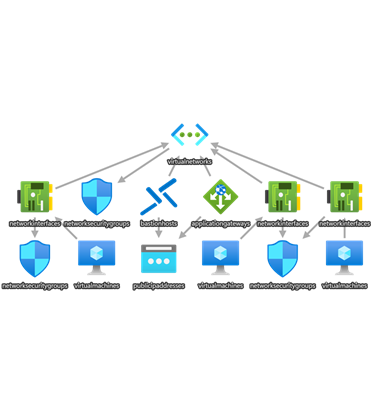

# Module Four Monitoring Linux Workloads in Azure

**Table of content:**

- [Monitoring Consideratiion](#item-one)
- [Monitoring Recommendatons](#item-two)
- [Linux Monitoring Lab](#item-three)
- [Next Steps and Call to Action](#item-four)

## Goal

This session aims to help the Microsoft's technical community better monitor critical Linux workloads on Azure by providing recommended practices and guidance. This session is geared towards using Azure Monitor with Linux virtual machines.

## Prerequisites for this Module

The completion of this module will require access to an active Azure subscription. Is is recommended to have at a minimum contributor access to the subscription for the successful deployment of resources.
<!--heading -->

## Monitoring Considerations

There isn’t definitive list of what you should monitor when you deploy something to Azure because “it depends”, on what services you’re using and how the services are used, which will in turn dictate what you should monitor and what thresholds the metrics you do decide to collect are and what errors you should alert on in logs. the following are some considerations for review.

- Consult with the customer or partner on their current monitoring solution and intent
- Engage with the application owners, architects, and developers to get a firm understanding of the application profile as well as system design limits
- Are there any external dependencies that are critical for the application to operate as intended
- Identify the application personas. Will access come from internal or external networks
- How will users authenticate against the application?
- Review if the customer administration model. Understand the required RBAC roles to implement Azure Monitor. Please review the following guidance [Roles, permissions, and security in Azure Monitor](https://learn.microsoft.com/en-us/azure/azure-monitor/roles-permissions-security)
- Understand the customers industry vertical to validate if there are specific regulatory requirements and monitoring retention required
- Validate name resolution in relation to the Linux workload as well as ancilliary services that interact with the specified workloads
- Has redundancy been implemented in the design and are there any SLA’s?
<!--heading -->
  

## Monitoring Recomendations

The following are some recommendations for review when monitoring Linux workloads in Azure.

- **Implementation:** Implement an initial set of metrics and limit potential “white noise“ and gradually add required counters
- Conduct an initial validation of the monitoring solution and how will it integrate with the current organizational structure
- **Notifications:** Implement email notifications, SMS alerts, Logic Apps, Azure automation runbooks, and ITSM tooling to enable additional capabilities integrating with the customers ticketing system as part of overall monitoring strategy
- **Web Tier:** Integrate Application Insights with your web tier to monitor the performance, availability, and usage of your web applications. This will help you track user interactions and detect anomalies
- **Business Tier:** Use Application Insights to monitor the business logic layer. This includes tracking custom events, exceptions, and performance metrics
- **Data Tier:** Monitor your database performance and query execution times using Azure Monitor or Oracle Enterprise Manager
- **Distributed Tracing:** Use Application Insights to implement distributed tracing. This helps you track requests as they flow through different components of the application, making it easier to diagnose performance issues and failures
- **Continuous Improvement:** Regularly review the collected data and adjust monitoring strategy as needed. Use the insights gained to optimize the application's performance and reliability
- **Leverage the Azure Monitor Baseline Alerts (AMBA)** This solution accelerator contains a list of recommended Azure Monitor metrics,activity log alert rules, and recommended thrshold values for the Azure Infrastructure platform. The solution can be implemented for an Azure Landing Zone (ALZ) which is either "greenfield" or "brownfield". Please refer to the following for further details [Azure Monitor Baseline Alerts](https://azure.github.io/azure-monitor-baseline-alerts/welcome/). Each of the alert rules documented have been compiled into Azure Policy definitions and these have then been packaged into logical Policy Initiatives based on the ALZ management group structure [Management Groups](https://learn.microsoft.com/en-gb/azure/cloud-adoption-framework/ready/landing-zone/design-area/resource-org-management-groups) as depicted in the below graphic.

<!--heading-->

## Linux Monitoring Lab

In the upcoming lab, participants will engage in deploying resources within Azure, crafting a tailored dashboard, and utilizing Azure Monitor to assess system health. The diagram provided below will illustrate the deployment architecture facilitated by the solution accelerator, which is designed to streamline and expedite the implementation process. You will need to follow the lab in the step by to step for succesful completion.

**Lab instructions**

| Step Number  | Comment                         |
| :----------- | :--------------------------     |
|  1           | Push Deploy to Azure Button |
|  2           | Your Azure Subscription with a custom populated template should appear on your computer screen                                | 
|  3           | Review the custom template and proceed to read each field. You have the options to leave the defaults or customize   | 
|  4           | Create a new resource group or use an existing within your Azure subscription in the region of choice                |
|  5           | PLEASE ADD UNIQUE NAMES for  Public IP's for both Applicaton Gateway and Bastion PIP                                 |
|  6           | Below you will see the request to create three new SSH Public keys. In the f1rst one name it web-01, second web-02, and the third db-01 in the name field |
|  7           | Review and ensureall fields are named properly                                                                        |
|  8           | Click Review + create                                                                                                 |
|  9           | If there are no errors from the validation click on the button "Create" to start the deployment                       |
| 10           | Once you hit "Create" a box will appear requesting you to download and create the SSH key pairs forthe three vm's. Save the zip file with the three keys to your comuter |
| 11           | Monitor the deployment on your screen. The deployment should complete in a few minutes                                |
| 12           | Unzip the file in your downloads folder to access the three SSH keys that were generated during the deployment        |                    
| 13           | When the deployment completes access web-01 through Bastion and make sure to have access to your SSH key for that vm  |
| 14           | In the Basrion access page make sure to change "VM Password" to "SSH Privae Key from local File". Enter the username from the deployment and click connect|
| 15           | Once you gain access to vm type in the following command  sudo apt update && sudo apt upgrade -y and hit enter                     |
| 16           | The system will begin to update with any required security updates. Wait until complete                                |
| 17           | You will see a box appear requesting "Which services should be restarted?" Leave the items in the window selected and hit tab, hit OK, and hit enter          | 
| 18           | Once that completes enter the following command sudo apt install apache2 -y and hit enter. the installation of the Apache web server will beigin |
| 19           | You will see a window on your screen requesting "Which services should be restarted?" click tab and place a  * for user@1001.service. Click tab on your keyboard and select OK. Hit enter on your keyboard                                                                                |
| 20           | Validate that the Aache web server is running. Type the following command, sudo systemctl status apache2.service and hit enter      |
| 21           | The status of the Apache daemon will appear on your screen. Enusre that you see "active running" which indicates web services are running.     |
| 22           | Type exit to logout of the server. Repeat the same exact same commands on web-02 to complete the web services for this application   |
| 23           | Look for the Public IP of the Application Gateway within the resource group. Take that IP and place it within your browser using HTTP. Example "http://20.12.26.232". The browser should render an Apapche splash page. The web tier is working properly. Proceed to configuring the database 
| 24           | Logon to db-01 using Bastion and the corresponding SSH keys                                                                          |
| 25           | Please run the following command "sudo apt update && sudo apt upgrade -y and hit enter                                               |               
| 26           | The system will begin to update. A window will appear asking "Which services should be restarted?" Accept the default selected and hit tab on your keyboard to ensure you are on the OK. Hit enter                                                                                                       |
| 27           | Type the following command sudo apt install mariadb-server -y and hit enter. The installation of the database will start.            |
| 28           | A window will apear on the screen asking "Which services should be restarted?" Accept the defaults, hit tab to ensure you are on the OK and hit enter |
| 29           | Next, start the Mariadb service by running the following command sudo systemctl start mariadb.service and hit enter                                   |
| 30           | Validate that the Mariadb service has started. Run the following command sudo systemctl status mariadb.service and hit enter. The response should return "active (running)" |
| 31           | For new MariaDB installations, the next step is to run the included security script. This script changes some of the less secure default options for things like remote root logins and sample users |
| 32           | Run the following command sudo mysql_secure_installation and hit enter                                                                                 |
| 33           | You will be prompted to enter a password for the Mariadb root account. Enter a strong password and hit enter                                           |
| 34           | The next prompt you can select "n" and hit enter                                                                                                       |
| 35           | The next prompt type "n" and hit enter as we have already assigned a password for theroot account. Hit enter                                           |
| 36           | The next prompt will ask to remove anonymous users. Select "Y" for yes which is a good security practice                                               |
| 37           | The next prompt will ask to remove the Mariadb root user ability to login remotely. Select "Y" for yes and this is also a good security practice.      |
| 38           | The next prompt will ask to remove the test database and access to it. Select "Y" and hit enter                                                        |
| 39           | The next screen will ask to reload the privileges table to apply the new changes to the Mariadb server. Select "Y" and hit enter                       |
| 40           | In this lab we will not go through the process of creating a new user accont or database on the Mariadb server. For this lab it is out of scope        |
| 41           | You will need to create an action group to trigger alerts from Azure Monitor. Please follow this article to create an Action Group in the Portal if you are unaware on how to do this. [Create an action group in the Azure portal ](https://learn.microsoft.com/en-us/azure/azure-monitor/alerts/action-groups#create-an-action-group-in-the-azure-portal)               |
| 42           | Create a custom dashboard in the Azure portal and name LinuxLevelUp25. If you are unsure how to create a custom dashboard please review the following article [Create a new dashboard](https://learn.microsoft.com/en-us/azure/azure-portal/azure-portal-dashboards#create-a-new-dashboard)  |
| 43           | Within your Azure subscription click on Azure Monitor, then go to Insights, and select Virtual Machines                         |                                                                          
| 44           | Click Configure Insights, the three virtual machines from the lab will be on the main blade with an Enable button next to each. Select "Enable" for each virtual machine one at a time.  |
| 45           | You will be prompted once again to configure a new data collection rule. Give it a memorable name and ensure you have a LogAnalytics in your azure subscription.                                                             |
| 46           | Once the deployment has completed go back to Azure Monitor, under the Insights Blade, select Virtual Machines, and select Performance from the top row            |
| 47           | If you click the Pin icon on each of the base counters created it will add it to the last dashboard that was open which you created earlier. Now you have the ability to add additional metrics in an adhoc manner to your custom dashboard. |

<!--heading-->

## Next Steps and Call to Action

Thak you for participating in the session. We have a few links we encourage you to review and study further as your sechedule permits. 
- [Azure Monitor Baseline Alerts Introduction Video](https://youtu.be/xeuxetAfHRg)
- [Azure Monitor Baseline Alerts Home Page](https://azure.github.io/azure-monitor-baseline-alerts/welcome/)
- [Introduction to deploying the AMBA ALZ Pattern](https://azure.github.io/azure-monitor-baseline-alerts/patterns/alz/deploy/Introduction-to-deploying-the-ALZ-Pattern/)
- [Azure Monitor Baseline Alerts GitHub Repo](https://github.com/Azure/azure-monitor-baseline-alerts/tree/main)
- [CentOS End-Of-Life guidance](https://learn.microsoft.com/en-us/azure/virtual-machines/workloads/centos/centos-end-of-life)
- [Linux and Open Source on Azure Quarterly Update - July 2024](https://techcommunity.microsoft.com/t5/linux-and-open-source-blog/linux-and-open-source-on-azure-quarterly-update-july-2024/ba-p/4205386)

